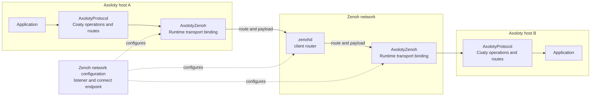

# Use Zenoh with Axoloty

This guide connects two Axoloty host runtimes through `zenohd`. It uses the
`AxolotyZenoh` adapter and does not require calls to Zenoh's C API.

## Keep the three layers separate

Axoloty protocol semantics, the Axoloty Zenoh binding, and Zenoh network
configuration have separate owners. The protocol creates and interprets Coaty
operations. The binding carries resolved routes and bytes. Zenoh routes those
bytes between sessions.



### Axoloty protocol semantics

`AxolotyProtocol` decides what a Coaty operation means, validates its route and
payload, and produces transport actions. Zenoh does not change those rules.
Coaty routes such as `coaty/3/<namespace>/CHN/<identifier>` become Zenoh key
expressions unchanged. The sealed `coaty/3` profile remains the same on MQTT
and Zenoh.

### Axoloty Zenoh binding

The `AxolotyZenoh` Swift package implements the host runtime transport. It opens
a Zenoh client session, declares profile and exact external-route
subscriptions, publishes resolved route and payload pairs, and polls bounded
receive queues. The C façade owns Zenoh's C values and their lifetimes. Swift
consumers use `ZenohBinding` and `ZenohBindingConfiguration` instead.

The host binding supports client mode with a router connect endpoint. Its
receive queues hold up to four frames per subscription. This is a fixed façade
bound and cannot be configured. It accepts keys up to 256 UTF-8 bytes and
payloads up to 2,048 bytes. Configuration can lower the key and payload limits.
Frames above either configured limit are dropped and counted in
`oversizedSamples`; neither limit can be raised above the façade maximum. The
façade reserves two of eight subscriber slots for profile subscriptions, so the
binding supports at most six exact external routes. A route containing `*` is
not exact and is rejected.

The binding has no lifecycle last will. The runtime passes an MQTT-compatible
last will: the identity's Deadvertise on its `DAD` route. `ZenohBinding`
accepts this value and discards it, because the v1 client profile uses only put
and subscriber and has no broker-published will. Epic
[#796](https://github.com/phynics/axoloty/issues/796) keeps Zenoh liveliness
out of v1 scope. A graceful `stop()` still publishes Deadvertise. After an
unclean disconnect, peers receive no Deadvertise for the lost node.

### Zenoh network configuration

`zenohd` owns network listening and routing. Start it with a listener endpoint.
Point each host binding at a reachable connect endpoint. The router does not
interpret Coaty operations or payloads.

The example below listens on all local interfaces at port `7447` and uses
`tcp/127.0.0.1:7447` for both clients. Use the router's reachable address when
the clients run on other hosts.

## Run the host example

The standalone package at [`Examples/ZenohHost`](../../Examples/ZenohHost)
depends on `Axoloty` and `Packages/AxolotyZenoh`. The root package does not
depend on Zenoh.

The steps below use the pinned Linux container. On macOS arm64, see
[Run the host example natively on macOS](#run-the-host-example-natively-on-macos).

First run the live tier. It downloads the pinned `zenohd` and
`zenoh-c` archives, verifies their SHA-256 checksums, and runs the binding's
live integration suite:

```sh
CONTAINER_NETWORK=host make test-tier TIER=zenoh-live BUILD_DIR=.build
```

The tier stores the verified router under
`.build/zenoh-live/dependencies/router/unpacked`. Start that binary in the
pinned container. The fallback locates `zenohd` if a later archive changes its
directory layout:

```sh
CONTAINER_NETWORK=host .devcontainer/run.sh sh -c 'router=/workspace/.build/zenoh-live/dependencies/router/unpacked/zenohd; if [ ! -x "$router" ]; then router=$(find /workspace/.build/zenoh-live/dependencies/router/unpacked -type f -name zenohd -print -quit); fi; test -n "$router"; exec "$router" -l tcp/0.0.0.0:7447'
```

In a second terminal, start the subscriber in the pinned development container:

```sh
CONTAINER_NETWORK=host \
CONTAINER_ENV_VARS='PKG_CONFIG_PATH LD_LIBRARY_PATH' \
PKG_CONFIG_PATH=/workspace/.build/zenoh-live/dependencies/zenoh-c/unpacked/lib/pkgconfig \
LD_LIBRARY_PATH=/workspace/.build/zenoh-live/dependencies/zenoh-c/unpacked/lib \
.devcontainer/run.sh swift run --package-path Examples/ZenohHost ZenohHost listen tcp/127.0.0.1:7447 demo
```

The subscriber prints `LISTENING channel=demo` when its runtime starts. In a
third terminal, send one message through a second host runtime:

```sh
CONTAINER_NETWORK=host \
CONTAINER_ENV_VARS='PKG_CONFIG_PATH LD_LIBRARY_PATH' \
PKG_CONFIG_PATH=/workspace/.build/zenoh-live/dependencies/zenoh-c/unpacked/lib/pkgconfig \
LD_LIBRARY_PATH=/workspace/.build/zenoh-live/dependencies/zenoh-c/unpacked/lib \
.devcontainer/run.sh swift run --package-path Examples/ZenohHost ZenohHost send tcp/127.0.0.1:7447 demo '{"privateData":{"message":"hello from host B"}}'
```

The subscriber prints `RECEIVED channel=demo payload={"privateData":{"message":"hello from host B"}}`. Stop
the subscriber and router with Ctrl-C. `PUBLISHED` means the Zenoh session
accepted the publication. It does not confirm delivery to the subscriber.
See [`docs/dependencies/zenoh.md`](../dependencies/zenoh.md) for the pinned
versions, artifacts, and live-tier details.

Use the command form `ZenohHost <mode> <endpoint> <channel> [payload]`. The
endpoint follows the mode. Use a valid Coaty Channel JSON payload with `send`.
`ZenohBindingConfiguration` defaults to `tcp/127.0.0.1:7447`, but this example
passes the endpoint explicitly. Both processes must use the same namespace and
channel identifier. The example uses namespace `zenoh-example`.

### Run the host example natively on macOS

On macOS arm64, the live tier runs with the native toolchain. It provisions the
pinned `aarch64-apple-darwin` archives under the same `.build/zenoh-live`
directory:

```sh
swift run --package-path Tools axoloty-tool test-tier zenoh-live
```

Start the verified router:

```sh
.build/zenoh-live/dependencies/router/unpacked/zenohd -l tcp/127.0.0.1:7447
```

The example reads `zenohc.pc` through `PKG_CONFIG_PATH`. SwiftPM drops the
runtime search path from pkg-config output, so pass it to the linker. In a
second terminal, start the subscriber:

```sh
ZC="$PWD/.build/zenoh-live/dependencies/zenoh-c/unpacked/lib"
PKG_CONFIG_PATH="$ZC/pkgconfig" swift run --package-path Examples/ZenohHost -Xlinker -rpath -Xlinker "$ZC" ZenohHost listen tcp/127.0.0.1:7447 demo
```

In a third terminal, send one message:

```sh
ZC="$PWD/.build/zenoh-live/dependencies/zenoh-c/unpacked/lib"
PKG_CONFIG_PATH="$ZC/pkgconfig" swift run --package-path Examples/ZenohHost -Xlinker -rpath -Xlinker "$ZC" ZenohHost send tcp/127.0.0.1:7447 demo '{"privateData":{"message":"hello from host B"}}'
```

The subscriber prints the same `RECEIVED` line as on Linux.

## Embedded smoke scenario

The embedded Zenoh implementation and its smoke scenario are tracked under
[`phynics/axoloty-embedded#8`](https://github.com/phynics/axoloty-embedded/issues/8).
Check that issue for current scope and setup. This repository does not contain
firmware instructions or device credentials.

## Inspect diagnostics

Call `await runtime.diagnosticsSnapshot()` on the host runtime. The snapshot
includes transport counters and runtime lifecycle counters. Read router logs
when the binding counters show a session failure but do not explain why the
router rejected or lost a connection.

| Symptom | Inspect |
|---|---|
| Router is not reachable | Check that `zenohd` is running and that its listener matches the binding endpoint. Inspect `sessionOpens` and `sessionFailures`, but do not treat a successful session open as proof of a router connection. Check router logs and network reachability. After an established connection drops, inspect `transportFailures` and `reconnects`. |
| Connect endpoint is invalid | Check the exact `connectEndpoint` string. Configuration rejects empty strings, whitespace, quotes, backslashes, non-ASCII bytes, and strings longer than 512 bytes. `ZenohBindingConfiguration(connectEndpoint:)` throws `ZenohBindingConfigurationError.invalidConnectEndpoint`. `ZenohBinding(connectEndpoint:)` maps that failure to `AxolotyError.invalidConfiguration`. |
| Oversized frames or receive drops | Inspect `oversizedSamples` for keys or payloads above configured limits, and `receiveDrops` for full fixed-depth per-subscription façade queues or frames the binding could not admit. `receivedFrames` counts frames admitted to the runtime callback. |
| External route subscription is rejected | The host binding accepts at most six exact external routes per session. Routes containing `*` are not exact Zenoh key expressions. See the [documented MQTT and Zenoh route difference](../../Packages/AxolotyZenoh/CONFORMANCE.md#mqtt-and-zenoh-protocol-trace-parity-811). |
| Router loss and recovery debounce | The binding reports loss only after all connected routers remain absent for one second. Inspect `sessionFailures`, runtime state, `transportFailures`, `reconnects`, and `transportReconnects`. A short router interruption can end before the debounce and produce no reconnect. |
| Live tier does not run | `zenoh-live` requires Linux x86_64 with host container networking, or macOS arm64 with the native toolchain. Check the tier output and `.build/zenoh-live` logs. The tier provisions pinned artifacts and verifies their checksums. |

For the full transport boundary, fixed capacities, and conformance rules, see
[`Packages/AxolotyZenoh/CONFORMANCE.md`](../../Packages/AxolotyZenoh/CONFORMANCE.md).
For the rationale behind the package boundary and host artifacts, see
[ADR 0007](../adr/0007-zenoh-adapter-package-boundary.md) and
[ADR 0006](../adr/0006-zenoh-host-dependency-packaging.md).
